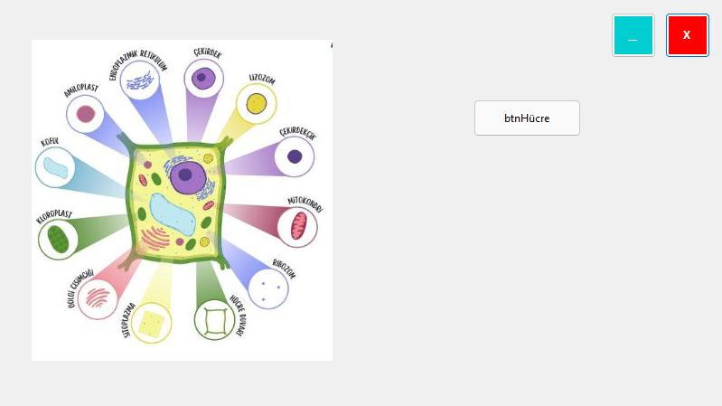
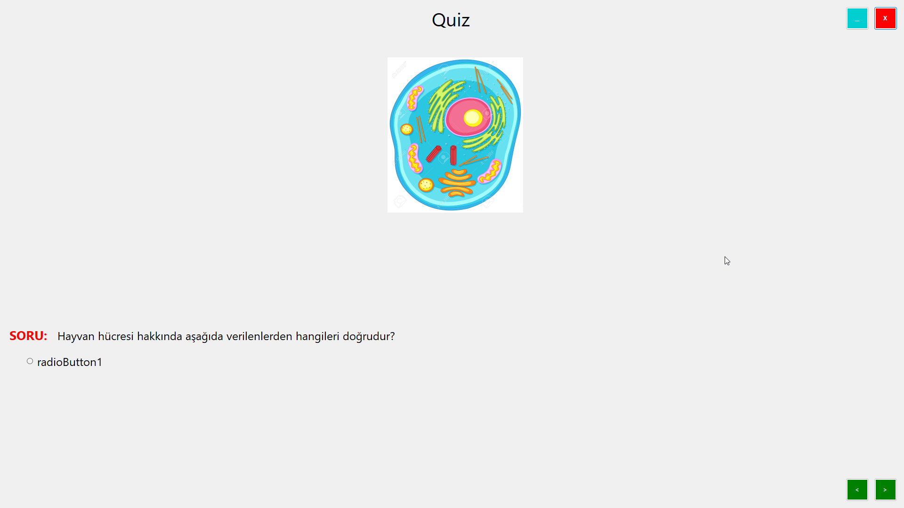
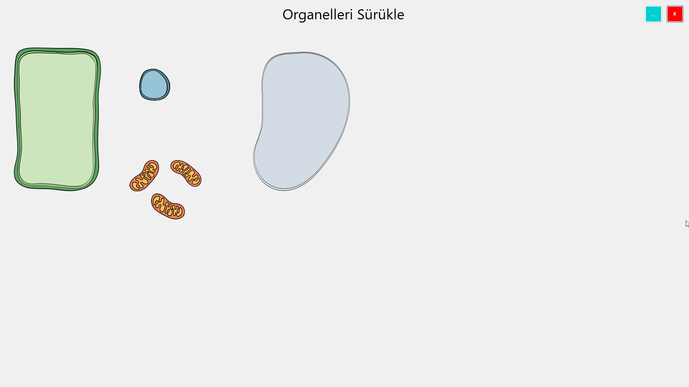
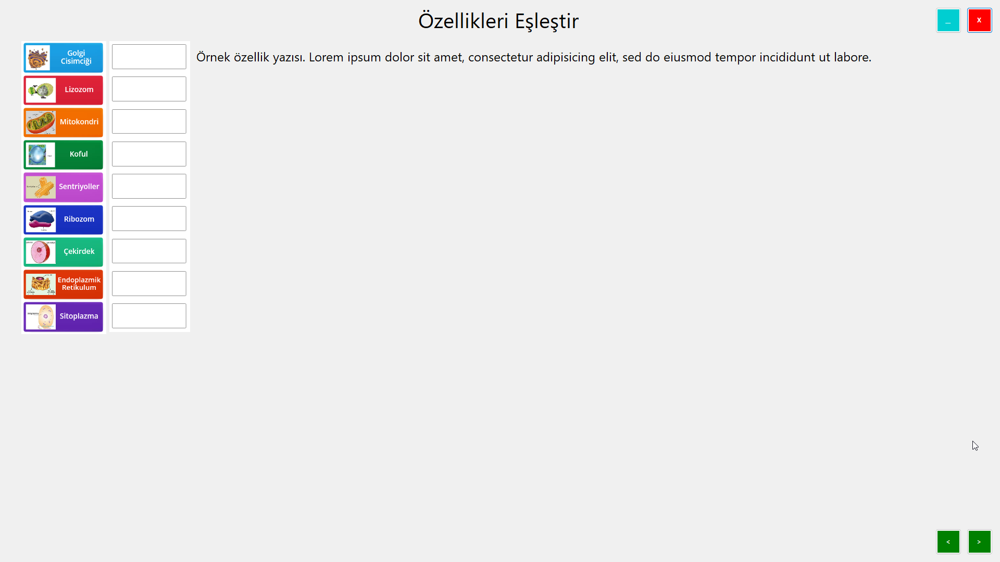

# BTE 202 - 2023 Grup C Uygulaması
## Yenilikler
- Uygulamalara yönlendiren Ana Menü oluşturuldu
- Arka plan fonksiyonlarını eklemek amacıyla basit arayüz oluşturuldu. Bazı görseller eklendi.
- Rastgele soru sorma özelliğine uyumlu olması için quiz soruları .csv formatındaki dosyaya eklendi.
- Kullanımı tanıtma, yeni özellikleri listeleme, indirme linki sunma ve grup üyelerini tanıtma amaçlı README.md dosyası eklendi.
## İndirme Linki
N/A
## Nasıl Kullanılır
### Karşılama Ekranı

### Hücrenin Yapısı
- 
### Quiz

### Organelleri Sürükle

### Özellikleri Eşleştir

## Grup Üyeleri
-