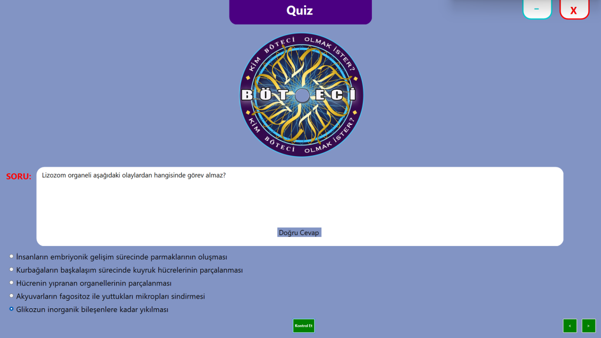
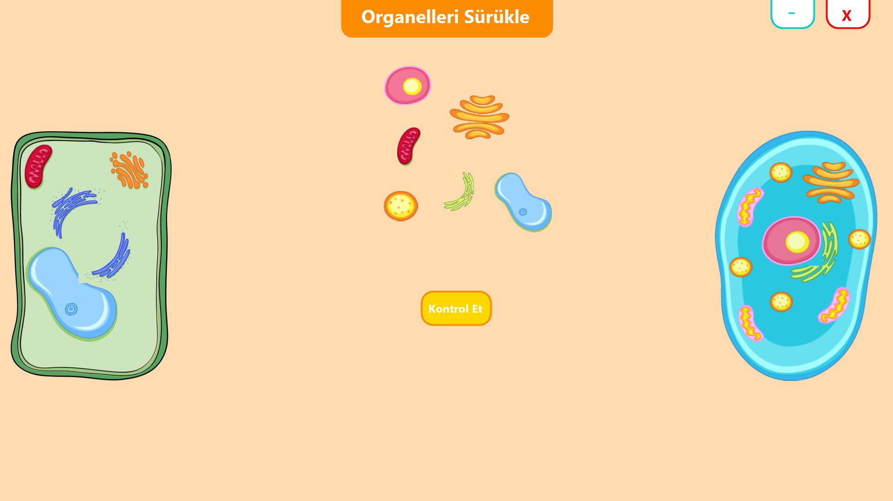

# BTE 202 - 2023 Grup C Uygulaması
## İndirme Linki
[İndir](https://github.com/the-woose/BTE-202-2023-Grup-C-Uygulamasi/releases/download/v0.6/uygulama.zip)
## Yenilikler
- Grafik arayüz planlanan görünüme getirildi.
- Köşeli butonların kullanımı için RoundedButton Sınıfı oluşturulup proje geneline eklendi.
- Sürükle bırak özelliği tamamlandı.
- Rastgele soru sorma özelliğitamamlandı.
- Soru bankası okuma özelliği tamamlandı.
- Konu okuma özelliği tamamlandı.
- Farklı cihazlarda testler yapıldı.
- İndirme linki güncellendi
- README.md güncellendi.
## Özellikler
## Nasıl Kullanılır
### Karşılama Ekranı

### Hücrenin Yapısı

### Quiz

### Organelleri Sürükle

### Özellikleri Eşleştir

## Grup Üyeleri
- Arife Boroğlu
- Barış Değirmenci
- Emre Taştankaya
- Selinay Ünal
- Sude Gündüz
- Yavuz Sava